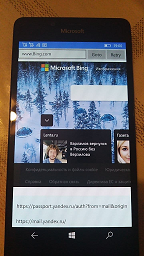

# MediaExplorer-Alpha

- ME 2021

** Sample app for web-surfing via WindowsPhone **

My simple project based on Messenger UWP (alpha) (source code : https://github.com/Sylvain2703/MessengerUWP/)

Messenger UWP app is based on the Messenger website ([www.messenger.com](https://www.messenger.com)) by using a WebView and injecting some JavaScript and CSS code.

Messenger UWP is a Universal Windows Platform app that lets you access **Facebook Messenger on Windows 10 PCs, tablets and phones**.

## Join the preview program 🐱‍💻

You can join the preview program and **easily install Messenger UWP** from the Microsoft Store.  
Use this [**form**](https://forms.gle/pnGc9xBpZ8snPG6d9) to apply for the preview program and you will soon be able to download the app. 
Please note that you need at least Windows 10 Creators Update (1507) to run Messenger UWP on Mobile (and Desktop) devices.  

Don't forget to **report bugs and send feedbacks** on the GitHub issues page.  
We really need feedback as there is probably some difference with [www.messenger.com](https://www.messenger.com) between countries.

## Features

All the following features are adapted to run on Windows 10 Desktop and Windows 10 Mobile. Other features can also works but aren't fully tested.

- Load | Navigate web pages
- Inject some JS (some web link modification)
- Debug panel below

## Roadmap

- Dark theme
- Notifications + Live Tiles + Badges

## Known issues

- Reactions, reply and forward to messages are not touch-friendly.
- In a thread, when a picture is too large, its preview isn't clipped away nicely.
- When the informations panel of a thread is opened, keyboard navigation can cause problems.

## Installation

For all users, join the preview program with the link above.

For developers:
- Install [Visual Studio 2019](https://developer.microsoft.com/en-us/windows/downloads) (VS 2017 should works too).
  - Install the "Universal Windows Platform Development" workload.
  - Install the Windows 10 SDK (build 15063 only).

- Clone the Messager UWP code repository:  
`git clone https://github.com/mediaexplorer/mediaexplorer-alpha.git`
- Open .sln file with Visual Studio 2019.

## Changelog

- Version 0.3.1:
  - Improve the loading screen and add a retry button.
  - Allow taking photos and recording audio messages.
  - Improve the picture album and the settings dialog for small screens.

## Author rights

UWP Messanger (C) 2019-2020 Sylvain Bruyère (GPL-3.0-only)
ME (c) 2021 (MIT License)

This repository is licensed with the [GNU General Public License v3.0 only (GPL-3.0-only)](/COPYING).
