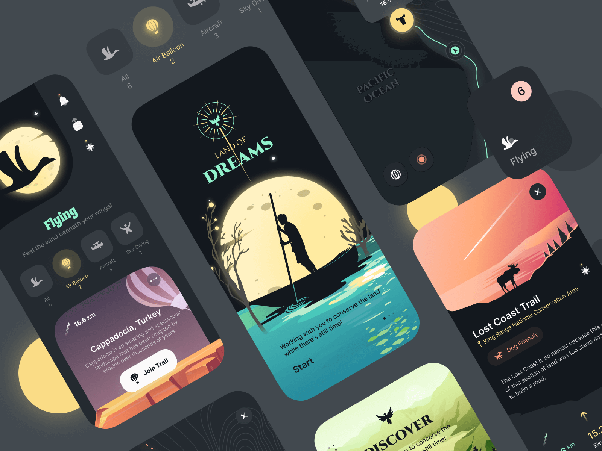

# MediaExplorer

## About / What is this?
- I did "reset" my old C# MediaExplorer-Alpha (for of uncompleted Onitor Browser).
New project has C++ code based on [MiniBlink49](https://github.com/weolar/miniblink49/) solution.
Draft. Init state (only "file collection" at now!)
- The main goal is to obtain better "rich media/multimedia" site browsing/web-surfing  via Chromium "reconstructiog".
- See Wiki section for more tech. details

## Status
- This repo does not include any UWP "mechanics" at now. 
- Solution build state: failed

## Referencies
- https://github.com/weolar/miniblink49/ The original MiniBlank49 project
- https://github.com/weolar Weolar, MiniBlank49's developer

## ..
AS-IS. No support. (For) RnD purposes only.

## .
[M][E] May, 2023

## P.S.
A few years ago, when Lumia phones were still "on the horse", I discovered their biggest problem: the lack of a modern browser. And, as a real bad developer who does not know how to calculate his own skill(s) and knowledge, I decided to take up... the development of such a browser! :) 

Well, I crawled all over the GitHub in order to find a good blank (template) for my solution. I found the Onitor project. There are a lot of cool things in it: working with tabs, the bookmarks bar. But! It is created in C#. It uses an outdated webview tied to a very elderly W10M system... So I gave up the idea of developing this thing. 

And so, in 2023, it occurred to me to revive my "autobiographical" project. I went through the whole GitHub again and dug up the abandoned Mini Blanc C++ project. What he is, so far I understand very vaguely. But, judging by the names of files and folders, it looks like a kind of "customization" of the Chromium project. I cultivated the structure of the solution a bit, filled in the Wiki section, and now I'm sharing a draft of the MediaExplorer solution. I have a feeling that this is my latest "invention" for Windows 10 Mobile. At the end I can only add "Sleep well, cool canceled system. -MediaExplorer" (fell silent)