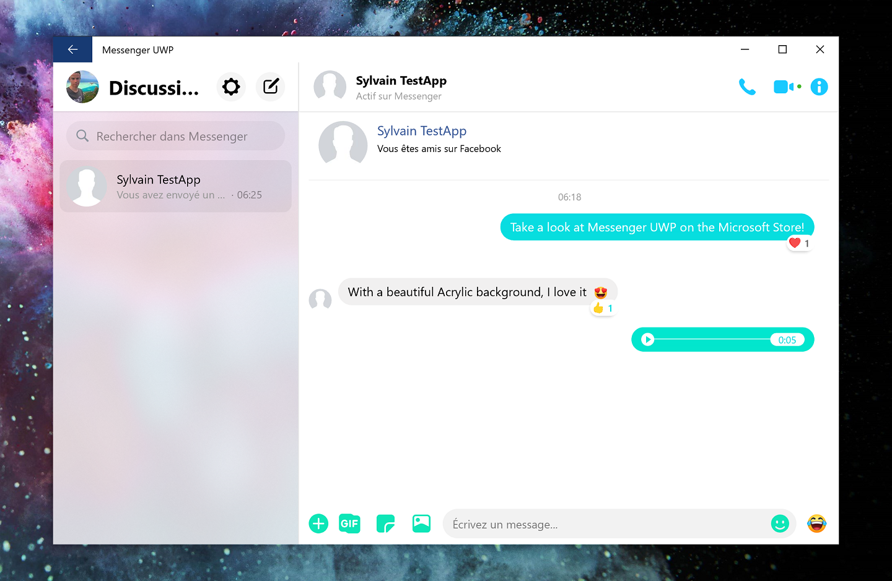

# MediaExplorer 0.3.1 - main bra[i]n[ch]

## About / What is this?
- I decide(d) to "reset" my too "hard C++ fork" of [MiniBlink49](https://github.com/weolar/miniblink49/) solution.
- This is some "game-of-life" repo for dreaming about hottest, smartest, minimal(istic) media-browser for Microsoft Devices family such old "new" WIndowsPhones, WInTablets, old XBoxes, etc.! ;)))

## Design (not real app!) of some ai-human browser-messenger-explorer :)

## Screenshot (5-years old)

## Status
- Under the construction (with help of newest AI)

## Referencies
- https://github.com/weolar/miniblink49/ The original MiniBlank49 project
- https://github.com/weolar Weolar, MiniBlank49's developer

## ..
AS-IS. No support. RnD purposes only. DIY.

## .
[M][E] May 16, 2026

## P.S.
A few years ago, when Lumia phones were still "on the horse", I discovered their biggest problem: the lack of a modern browser. And, as a real bad developer who does not know how to calculate his own skill(s) and knowledge, I decided to take up... the development of such a browser! :) 

Well, I crawled all over the GitHub in order to find a good blank (template) for my solution. I found the Onitor project. There are a lot of cool things in it: working with tabs, the bookmarks bar. But! It is created in C#. It uses an outdated webview tied to a very elderly W10M system... So I gave up the idea of developing this thing. 

And so, in 2023, it occurred to me to revive my "autobiographical" project. I went through the whole GitHub again and dug up src codes of  _MiniBlink49_ C++ project. What he is, so far I understand very vaguely. But, judging by the names of files and folders, it looks like a kind of "customization" of the Chromium project. I cultivated the structure of the solution a bit, filled in the Wiki section, and now I'm sharing a draft of the MediaExplorer solution. I have a feeling that this is my latest "invention" for Windows 10 Mobile. At the end I can only add "Sleep well, cool canceled system. -MediaExplorer" (fell silent)